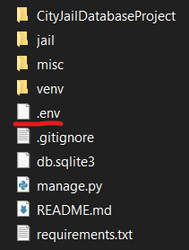

# City Jail Database Project

## How to install

You can use VSCode, PyCharm, or whatever editor/IDE you want to use.
It's probably easier with PyCharm.

1. First clone the git repository

```
git clone https://github.com/awu0/City-Jail-Database-Project.git
```

2. Go into the folder that has `requirements.txt`
3. It is recommended to create a virtual environment. Look at
   the [official documentation](https://docs.python.org/3/library/venv.html) or just Google it
4. Start the virtual environment and install the requirements needed to run the app

```
pip install -r requirements.txt
```

***Make sure the virtual environment is running before starting the app.***

### Setting up .env file

You will be given a `.env` file, which contains all the environment variables. This file is important and should **NOT**
be commited. Put this file in the base directory (the one with `manage.py`).



### Running the server
On Windows:
```
python manage.py runserver
```

on MacOS & Linux:
```
python3 manage.py runserver
```

Something like this should show up:
```
Performing system checks...

System check identified no issues (0 silenced).

You have unapplied migrations; your app may not work properly until they are applied.
Run 'python manage.py migrate' to apply them.

April 15, 2024 - 15:50:53
Django version 5.0, using settings 'mysite.settings'
Starting development server at http://127.0.0.1:8000/
Quit the server with CONTROL-C.
```
## Django

A brief tutorial on Django can be found [here](https://docs.djangoproject.com/en/5.0/intro/tutorial01/).
We are using Django because it is easier to use than Flask (what the professor introduced in class).
